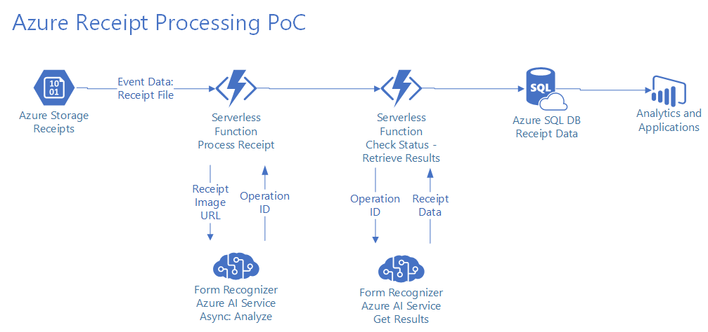

## Receipt Ingestion Proof of Concept (PoC)

This PoC shows ingestion of typical point of sale receipt images, with analysis and content extraction. The Form Recognizer Azure AI service is used (this service is currently in Preview). It has specific receipt ingestion capability.

The architecture for this PoC (see below for diagram) starts with Azure blob storage. A storage access policy is set on storage so that images can be stored securely (not publicly accessible), but URLs with policy-based access tokens can be generated so that services like the Azure AI Cognitive Services used in this PoC can still access the images via secured URLs.

When a receipt image is uploaded to blob storage, an Event Grid event is raised. This triggers an Azure Function, which gets metadata about the image, including its secured URL. This first Azure Function then invokes the Form Recognizer's Analyze Receipt endpoint and sends it the secured URL of the receipt. This is an asynchronous operation which returns a URL to check status and retrieve results (when processing is finished) of receipt analysis. This Function concludes by assembling some operational metadata and placing it onto a queue.

The queue triggers a second Azure Function. That Function retrieves operation metadata from the queue, and checks the status of the referenced receipt processing operation. If the operation has not started or is still running, the Function re-enqueues this receipt's metadata with a timeout before becoming visible on the queue again (to allow the service additional time to complete processing). If the operation succeeded, then all the receipt data is persisted to a SQL database.

This PoC uses receipt images (in the TestImages folder). All of these were sourced from searches on bing.com/images. All images are believed to be in the public domain and free of copyright or other constraints. Please advise if this is incorrect.

 contains the following fields:
- ReceiptGuid
- Subtotal
- Tax
- Total
- MerchantName
- MerchantAddress
- MerchantPhoneNumber
- TransactionDate
- TransactionTime
- ImageUrl
- JsonFormRecognizer
- DateCreated
- DateUpdated

ImageUrl is the secured URL to the image, stored in Azure blob storage. The storage account is not publicly accessible; a storage access policy is in place. The ImageUrls in the data have an access token included in the URL, to show how images can be stored securely against general public access, but be made accessible via URL for APIs like the Azure AI cognitive services.

JsonFormRecognizer is the complete JSON output from the Form Recognizer Azure AI Cognitive Service. It can be made more easily readable in a good JSON editor like Visual Studio Code with a JSON extension, or in other text editors with appropriate JSON capabilities. Alternately, to avoid tool extension downloads/installs, the JSON can be pasted into an online JSON renderer like that at https://jsonformatter.curiousconcept.com/.

The fields from Subtotal through TransactionTime are all extracted from JsonFormRecognizer via SQL JSON_VALUE() calls, and surfaced as standalone fields for greater readability. See  for details.

Resources:
* [Form Recognizer Azure AI Cognitive Service Overview](https://docs.microsoft.com/azure/cognitive-services/form-recognizer/overview)
* [Form Recognizer API Docs](https://westus2.dev.cognitive.microsoft.com/docs/services/form-recognizer-api)

---

### PLEASE NOTE FOR THE ENTIRETY OF THIS REPOSITORY AND ALL ASSETS
#### 1. No warranties or guarantees are made or implied.
#### 2. All assets here are provided by me "as is". Use at your own risk. Validate before use.
#### 3. I am not representing my employer with these assets, and my employer assumes no liability whatsoever, and will not provide support, for any use of these assets.
#### 4. Use of the assets in this repo in your Azure environment may or will incur Azure usage and charges. You are completely responsible for monitoring and managing your Azure usage.

---

Unless otherwise noted, all assets here are authored by me. Feel free to examine, learn from, comment, and re-use (subject to the above) as needed and without intellectual property restrictions.

If anything here helps you, attribution and/or a quick note is much appreciated.